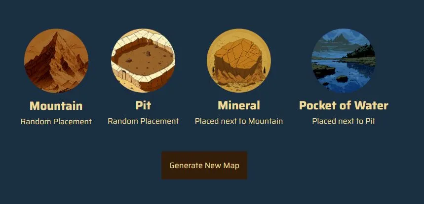
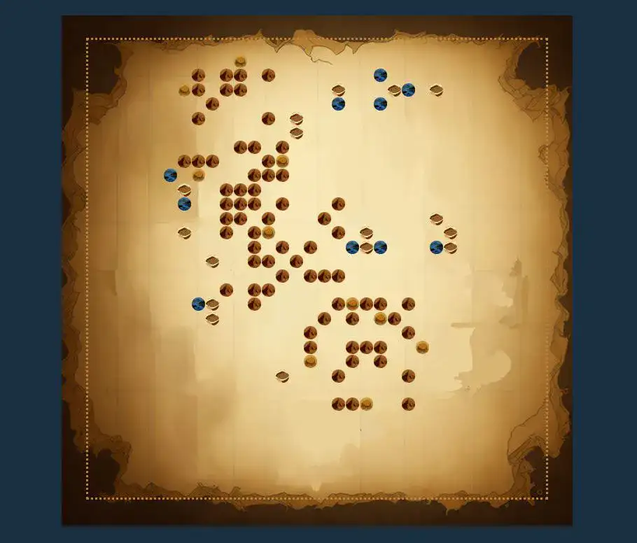
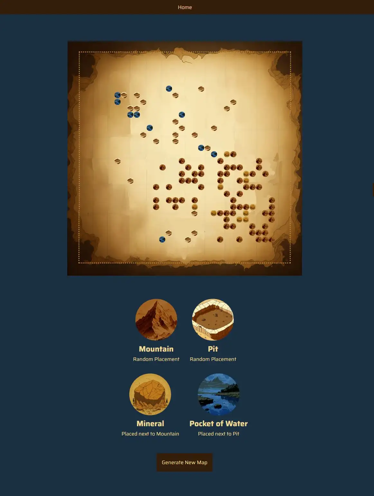

# About

Desktop and tablet Map Generator Application with React frontend and Java Spring Boot backend. Just click a button and you get a map!

- custom designed images
- functional components
- java controller api for spring boot application
- map and map element configuration, generation, validation, positioning
- map writing to .map file and display representation
- unit testing


# Technologies & Tools

- JavaScript (lightweight interpreted programming language)
- React (frontend JavaScript library for building user interfaces based on components)
- Java (high-level, class-based, object-oriented programming language)
- Maven (build automation tool)
- Spring Boot (Java framework)
- HTML (HyperText Markup Language)
- CSS (for styling)
- SCSS (CSS preprocessor)

# Features

- predefined resource types to get added to the map according to placement rules
- generate map button to create a new map



Map to populate with resources.



# Tablet View



# Setup

Must haves on your machine:
Node.js
JDK 17+ 
Apache Maven

Recommended IDEs:
Visual Studio Code or IntelliJ IDEA

## Server side

### Run application

Open the Application.java file (in the java folder) and Run the application

Your local server should now be running!

## Client side

### Install Dependencies

Open the terminal and navigate to the frontend folder. Once inside, run this command:

```
npm install
```

### Start client 

From inside the frontend folder, run this command in the terminal:

```
npm start
```

You should see in the terminal that the client has been started at: http://localhost:3000/
You can copy + paste it in your browser if it doesn't start automatically. 