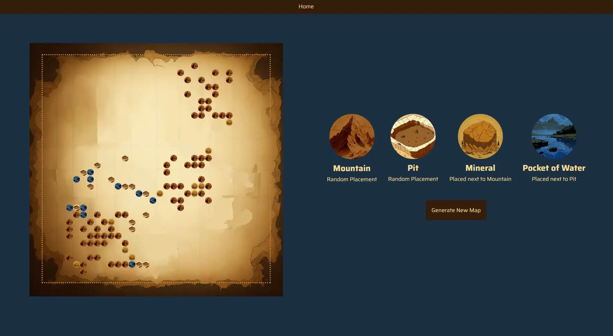

# About



# Setup

## Server side

### Run application

Open the Application.java file (in the java folder) and Run the application

Your local server should now be running!

## Client side

### Install Dependencies

Open the terminal and navigate to the frontend folder. Once inside, run this command:

```
npm install
```

### Start client 

From inside the frontend folder, run this command in the terminal:

```
npm start
```

You should see in the terminal that the client has been started at: http://localhost:3000/
You can copy + paste it in your browser if it doesn't start automatically. 